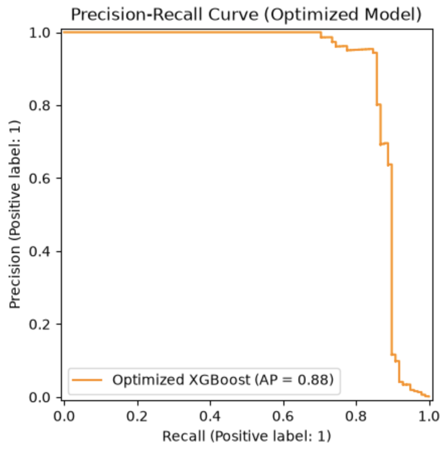
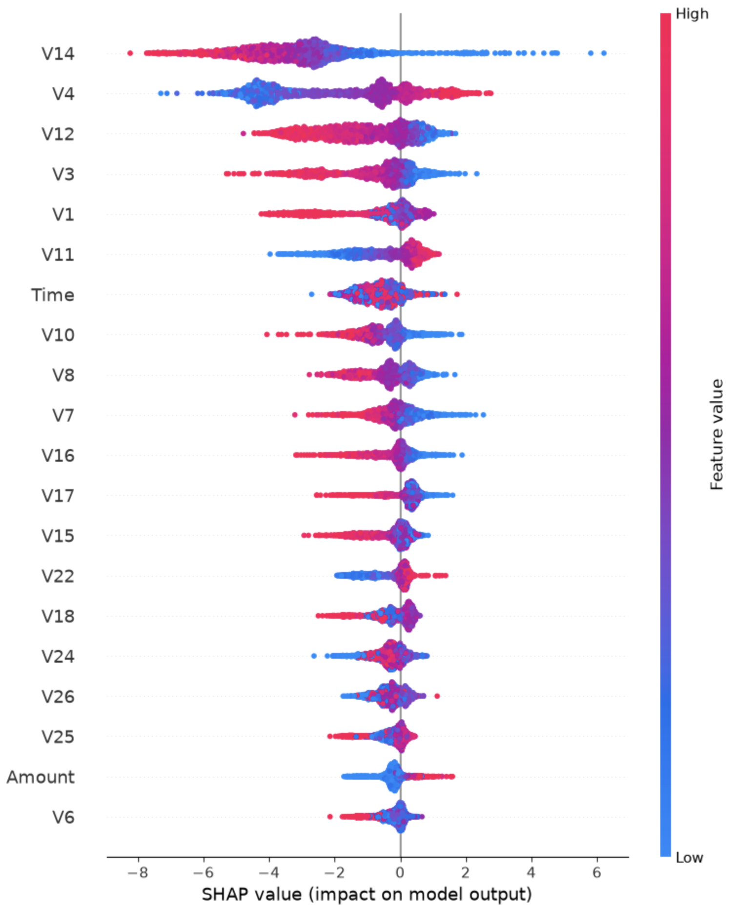

# Real-Time Credit Card Fraud Detection API

A production-style fraud detection service that flags potentially fraudulent credit card transactions in real time. The model is trained on the highly imbalanced [Kaggle Credit Card Fraud dataset](https://www.kaggle.com/datasets/mlg-ulb/creditcardfraud), tuned with hyperparameter search + experiment tracking, served behind a FastAPI inference endpoint, containerized with Docker, and deployed live on Render.

**🔗 Live Backend API:** [credit-card-fraud-detection-gv3r.onrender.com/predict](https://credit-card-fraud-detection-gv3r.onrender.com/predict) ([interactive Swagger docs](https://credit-card-fraud-detection-gv3r.onrender.com/docs))

---

## Why this is hard

Out of ~285,000 transactions in the training data, only **492 (0.173%)** are fraudulent. A model that predicts "not fraud" every single time would score 99.8% accuracy and be completely useless. So the entire design of this project — resampling strategy, choice of metric, and decision threshold — is built around that imbalance rather than around raw accuracy.

## Results

| Metric | Score |
|---|---|
| **PR-AUC (Average Precision)** | **0.8841** |
| Precision (Fraud class) | 0.73 |
| Recall (Fraud class) | 0.87 |

Precision-Recall AUC was used instead of ROC-AUC because, on a 1:577 class imbalance, ROC-AUC stays misleadingly high even for a weak model — PR-AUC is far more sensitive to how the model actually performs on the rare fraud class.

<p align="center">
  
</p>

**Reading this curve:** each point on the orange line corresponds to a different decision threshold. Moving left-to-right along the curve trades precision for recall — at low recall (top-left), the model is only flagging transactions it's extremely confident about, so almost every flag is correct (precision near 1.0). As the threshold is lowered to catch more fraud (recall increases, moving right), precision holds close to 0.95+ up to roughly 70–80% recall, then drops off sharply past ~85% recall — meaning beyond that point, catching additional fraud cases starts costing a disproportionate number of false alarms. The chosen operating threshold sits in that steep drop-off region deliberately, prioritizing recall (catching fraud) over precision (avoiding false alarms), which is the right tradeoff when a missed fraud is far costlier than investigating a false positive. The Average Precision (AP = 0.88) is the area under this entire curve — a single number summarizing performance across all possible thresholds.

## How it works

**1. Handling class imbalance — SMOTE:**:
Rather than training on the raw 1:577 imbalance, [SMOTE](https://imbalanced-learn.org/) (Synthetic Minority Over-sampling) generates synthetic fraud examples via interpolation between real fraud cases, balancing the training set before the model ever sees it.

**2. Model — XGBoost, tuned via RandomizedSearchCV:**
SMOTE and XGBoost are chained into a single `imblearn` pipeline so resampling happens *inside* each cross-validation fold (avoiding data leakage from the validation set into training). Hyperparameters were tuned with `RandomizedSearchCV` (20 iterations, 3-fold stratified CV, scored on average precision) across learning rate, max depth, number of estimators, subsample, and column subsample ratios.

**3. Experiment tracking — MLflow:**
Every tuning run is logged to MLflow (`mlflow.db`, SQLite backend) via `mlflow.sklearn.autolog()` — parameters, metrics, and the best run are queried programmatically in `train.py` rather than copy-pasted by hand.

**4. Business-driven decision threshold:**
Rather than the default 0.5 cutoff, the classification threshold was chosen by walking the precision-recall curve to find a recall-first operating point — deliberately catching more fraud at the cost of some false positives, since in fraud detection a missed fraud is typically far more costly than a false alarm.

**5. Interpretability — SHAP:**
SHAP values were computed to understand *which* transaction features drive the model's fraud predictions, rather than treating XGBoost as a black box.

<p align="center">
  
</p>

**Reading this plot:** each row is one of the 28 anonymized features (plus `Time` and `Amount`), ranked top-to-bottom by overall impact on the model's predictions. Each dot is one transaction in the test set; its horizontal position is that transaction's SHAP value — how much that specific feature pushed the prediction toward fraud (positive, right) or away from it (negative, left) — and its color shows whether that feature's actual value was high (red) or low (blue) for that transaction.

`V14` has by far the widest spread, making it the single most influential feature, followed by `V4` and `V12`. The color pattern tells a directional story too: for `V14`, low feature values (blue) push the prediction toward fraud (right side), while high values (red) push away from it (left side) — the opposite relationship holds for `V4`, where high values (red) push toward fraud. Since `V1`–`V28` are PCA-anonymized, there's no way to map these back to real-world concepts like "transaction location" or "merchant category" — but this plot still proves the model isn't relying on `Amount` or `Time` alone (both rank comparatively low), which is reassuring: it means the fraud signal is coming from genuine behavioral patterns in the anonymized features, not just "is this an unusually large purchase."

## Architecture

```
Client (script / Postman)
        │
        │  POST /predict   { Time, features: {V1..V28}, Amount }
        ▼
┌───────────────────────────────┐
│   FastAPI (api.py)            │
│   - Pydantic request schema   │
│   - Loads pipeline ONCE on    │
│     startup (singleton)       │
└───────────────┬───────────────┘
                │
                ▼
┌───────────────────────────────┐
│  FraudDetectionModel          │
│  (fraud_detector.py)          │
│   - SMOTE (train-time only)   │
│   - XGBoost Classifier        │
│   - business threshold        │
└───────────────┬───────────────┘
                │
                ▼
     { status, risk_score, is_flagged }
```

The model is trained offline (`train.py`) and serialized with `joblib` into `fraud_detector_model.pkl`, which the API loads once into memory at startup rather than reloading per-request — keeping inference latency low.

## Project structure

```
.
├── 01_baselien_model_and_predictions.ipynb   # EDA + baseline XGBoost model
├── 02_OOP_pipeline.ipynb                     # Hyperparameter search, MLflow tracking, SHAP
├── fraud_detector.py                         # FraudDetectionModel class (SMOTE + XGBoost pipeline)
├── train.py                                  # Pulls best MLflow run, retrains, saves model artifact
├── api.py                                    # FastAPI inference service
├── client_test.py                            # Example client hitting the live API
├── test_fraud_detector.py                    # pytest unit tests for the model class
├── fraud_detector_model.pkl                  # Serialized trained pipeline
├── mlflow.db                                 # SQLite MLflow tracking store
├── Dockerfile
├── .dockerignore
├── requirements.in / requirements.txt
└── README.md
```

## Example input — a real row from the dataset

The 28 `V1`–`V28` features are the result of a PCA transformation the dataset's authors applied to the original transaction attributes (to anonymize them), so there's no way to know what each one "means" individually — only how it influences the model (see the SHAP section below).

Here's a genuine row taken directly from the [Kaggle Credit Card Fraud dataset](https://www.kaggle.com/datasets/mlg-ulb/creditcardfraud) (`creditcard.csv`, row index 0) — a real, **legitimate** transaction (`Class: 0`):

```json
{
  "Time": 0.0,
  "features": {
    "V1": -1.359807, "V2": -0.072781, "V3": 2.536347,
    "V4": 1.378155,  "V5": -0.338321, "V6": 0.462388,
    "V7": 0.239599,  "V8": 0.098698,  "V9": 0.363787,
    "V10": 0.090794, "V11": -0.5516,  "V12": -0.617801,
    "V13": -0.991390,"V14": -0.311169,"V15": 1.468177,
    "V16": -0.470401,"V17": 0.207971,"V18": 0.025791,
    "V19": 0.403993, "V20": 0.251412, "V21": -0.018307,
    "V22": 0.277838, "V23": -0.110474,"V24": 0.066928,
    "V25": 0.128539, "V26": -0.189115,"V27": 0.133558,
    "V28": -0.021053
  },
  "Amount": 149.62
}
```

Feeding this into `/predict` correctly returns a low `risk_score` and `is_flagged: false`, matching its true label.

> 📊 **Want to test against an actual fraud case?** The dataset only contains 492 fraud examples out of ~285,000 rows (`Class: 1`), and none were printed in this project's notebooks — so rather than fabricate one, grab a real fraud row yourself: download `creditcard.csv` from the [Kaggle page](https://www.kaggle.com/datasets/mlg-ulb/creditcardfraud), then run `df[df['Class'] == 1].sample(1)` to pull one out and feed its `V1`–`V28`/`Time`/`Amount` values into the payload above.

## API reference

### `POST /predict`

**Request body**

Same shape as the example above — `Time` (float), `features` (a flat object with literal keys `V1` through `V28` mapped to numbers), and `Amount` (float).

> ⚠️ `features` must be a flat JSON object with literal keys spelled out — this is a REST API, so each key/value pair has to be explicit JSON, not a Python expression. (If you're scripting against it in Python, you can build that dict programmatically — e.g. `{f"V{i}": 0.0 for i in range(1, 29)}` — and the `requests` library will serialize it to valid JSON for you. Tools like Postman, however, expect literal JSON, not Python syntax — passing `{f"V{i}": ...}` directly into Postman's raw body will fail with a `422 JSON decode error`.)

**Response**

```json
{
  "status": "success",
  "risk_score": 0.0034416248090565205,
  "is_flagged": false
}
```

- `risk_score` — model's predicted probability that the transaction is fraudulent (0–1)
- `is_flagged` — `true` if `risk_score` exceeds the tuned decision threshold

### Try it yourself

```bash
curl -X POST https://credit-card-fraud-detection-gv3r.onrender.com/predict \
  -H "Content-Type: application/json" \
  -d '{
    "Time": 0.0,
    "features": {"V1": -1.359807, "V2": -0.072781, "V3": 2.536347, "V4": 1.378155, "V5": -0.338321, "V6": 0.462388, "V7": 0.239599, "V8": 0.098698, "V9": 0.363787, "V10": 0.090794, "V11": -0.5516, "V12": -0.617801, "V13": -0.991390, "V14": -0.311169, "V15": 1.468177, "V16": -0.470401, "V17": 0.207971, "V18": 0.025791, "V19": 0.403993, "V20": 0.251412, "V21": -0.018307, "V22": 0.277838, "V23": -0.110474, "V24": 0.066928, "V25": 0.128539, "V26": -0.189115, "V27": 0.133558, "V28": -0.021053},
    "Amount": 149.62
  }'
```

Or run `client_test.py` locally, or explore the auto-generated Swagger UI at [`/docs`](https://credit-card-fraud-detection-gv3r.onrender.com/docs).

## Running locally

```bash
# Clone and install
git clone <your-repo-url>
cd <repo-name>
pip install -r requirements.txt

# Run the API
uvicorn api:app --reload --port 8000

# In another terminal, test it
python client_test.py   # update the url variable to http://127.0.0.1:8000/predict
```

### With Docker

```bash
docker build -t fraud-detector-api .
docker run -p 8000:8000 fraud-detector-api
```

### Retraining the model

```bash
python train.py   # pulls the best hyperparameters from MLflow and retrains
```

### Running tests

```bash
pytest test_fraud_detector.py
```

## Tech stack

| Layer | Tools |
|---|---|
| Modeling | scikit-learn, XGBoost, imbalanced-learn (SMOTE) |
| Experiment tracking | MLflow |
| Interpretability | SHAP |
| Serving | FastAPI, Pydantic, Uvicorn |
| Containerization | Docker |
| Deployment | Render |

## Deployment notes

The API is deployed on [Render](https://render.com) directly from this repository's `Dockerfile`. Render injects a `PORT` environment variable at runtime, so the container's entrypoint binds to `${PORT:-8000}` rather than a hardcoded port — falling back to `8000` for local Docker runs.

---

